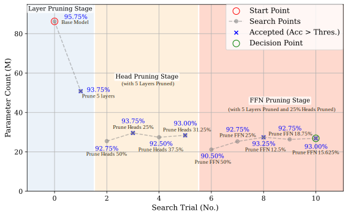

# Adaptive Inference Pruning (AIP)

This repository provides the implementation of **Adaptive Inference Pruning (AIP)** and **Adaptive Depth-wise Pruning (ADP)** for efficient structured pruning of audio models, such as the Audio Spectrogram Transformer (AST). Our method supports both layer-level pruning and fine-grained intra-layer pruning (e.g., attention heads, FFN units), under a performance constraint.

All results and visualizations are saved to the `results/` directory.

---
## Example: Pregressive Pruning using ADP + AIP



## 🛠️ How to Use

| Function | Description | Command |
|----------|-------------|---------|
| **Layer pruning (ADP)** | Automatically finds optimal number of layers under accuracy constraints | `python adp.py` |
| **Intra-layer pruning (AIP)** | Prunes attention heads or FFN units within each layer | `python aip.py` |
| **Visualization (ADP)** | Plots pruning trajectory and accuracy vs. parameter trade-off | `python plot_adp.py` |
| **Visualization (AIP)** | Visualizes intra-layer pruning results | `python plot_aip.py` |

> 🔧 All logs and plots are saved in the `results/` directory.

---

## 🧱 Environment

We recommend Python 3.8+ and PyTorch 1.10+.

You can install dependencies with:

```bash
pip install -r requirements.txt
